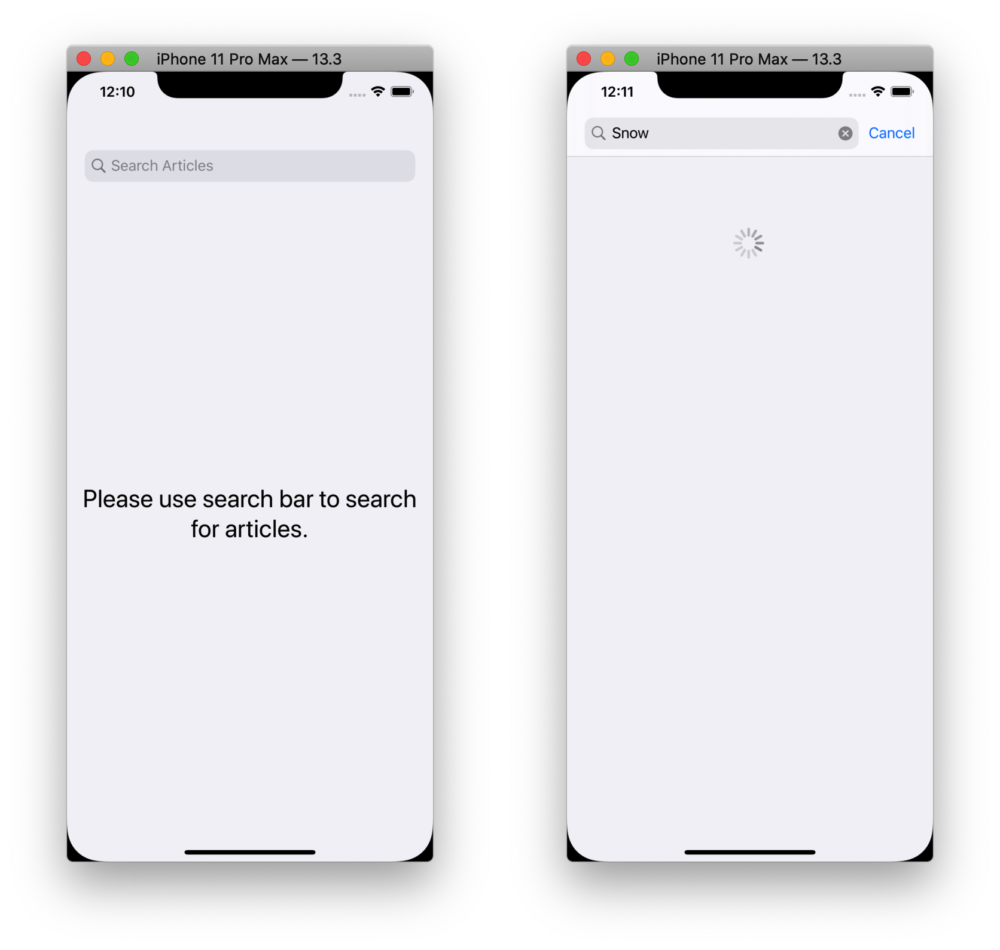
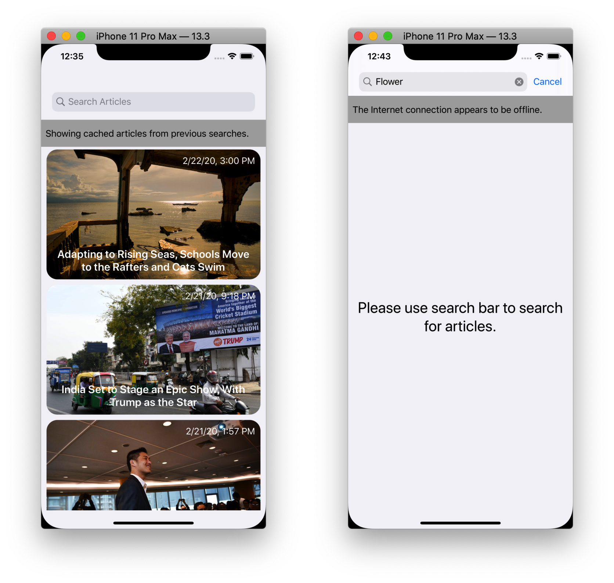

# articly
An iOS app that let user search articles from New York Times API

### How To Run
- Clone the app repo

  ```git clone https://github.com/khurram18/articly.git```

- Navigate to the cloned directory and open `Articly.xcodeproj` by double clicking on it and opening it in Xcode.
- Press `Command + R` to run the app in iOS Simulator.

### Demo
- Screen recording showing the app working can be found [here.](https://drive.google.com/open?id=1gqdp50Vev_o8MurBUuKCiILekF3PdD0K)

- Below are few screenshots demonstrating the different states of the app.


Left image shows the initial state of app. It asks users to use search bar to search for articles. Right image shows the state of app when loading articles from API.


Left image shows the list of articles fetched from API. Right image shows another screen displaying the article details.


These images show a user friendly way to display a message to user.


This image shows the loading state when user scrolls to bottom of screen and next page is being loaded.
